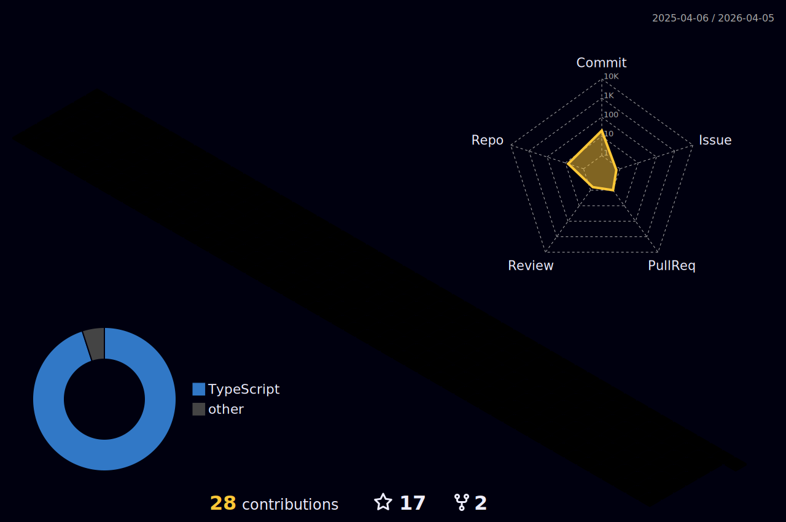

Hi! My name is Rafael Rocha 👋
===================================

- 🖥️ Front End Developer
- 🚀 Trybe Student
- 🌍  I'm based in Rio de Janeiro - Brazil
- 🖥️  See my portfolio at [My Portfolio](https://rafaelrocha-portfolio.vercel.app)
- ✉️  You can contact me at [1rafaelrocha2@gmail.com](mailto:1rafaelrocha2@gmail.com)
- 🧠  I'm learning NextJS and TypeScript
- 🤝  I'm open to collaborating on social projects

 

## Skills

	
	
	
	
	
	
	
	
	
	
	
	
	
	
	
	

 

## Socials

	
	
	
	

 

## My GitHub Stats

 

 

	

