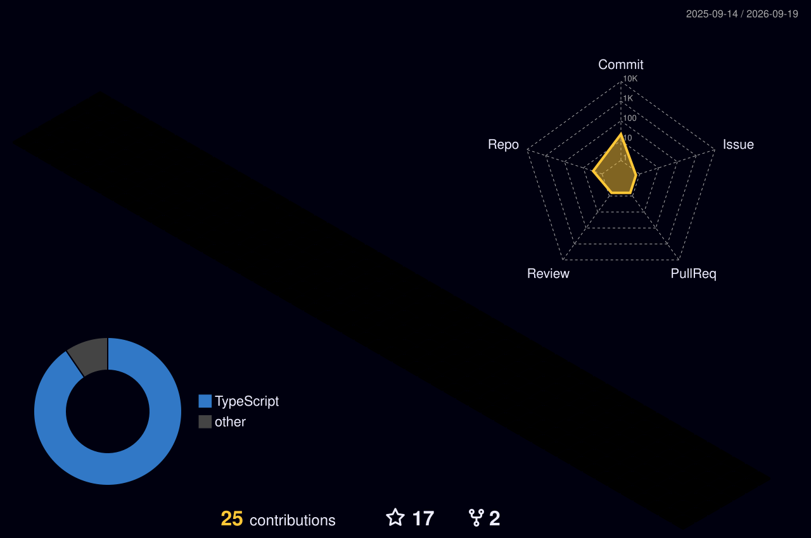

# Hi, I'm Rafael Rocha

**Front-End Engineer** · React · TypeScript · Design Systems

I build revenue-critical SaaS interfaces end to end, from architecture decisions to the pixels customers
use every day. Since 2023 I have been at [uMode](https://umode.com.br), where I moved from writing product
screens to leading the front-end of the platform the whole company sells. I work in **React and TypeScript**
with Domain-Driven Design and Clean Architecture, and I ship the **NestJS and Ruby on Rails** services behind
the interfaces I build.

- 🌍 Based in Campos dos Goytacazes, Brazil · open to remote work
- 🧰 This is my personal account. My day-to-day work lives at [@URafaelRocha](https://github.com/URafaelRocha)
- 🗣️ Portuguese (native) · English (intermediate)

## What I'm working on

- **Leading the front-end** of a multi-product dashboard: React 18 + TypeScript organized by Domain-Driven
  Design and Clean Architecture across 14 product domains.
- **A design system published to the public npm registry**: 145 components, semantic design tokens, light and
  dark themes, automated releases, and a codemod that migrated an entire dashboard onto it in one cycle.
- **An embeddable AI agent** that turns a request written in plain language into a reviewed Pull Request,
  built on the Claude Agent SDK with a NestJS control plane running on AWS.

## Tech stack

**Front-end**

**Back-end**

**Data**

**Cloud & tooling**

**Testing**

**AI**

**Also work with:** Domain-Driven Design, Clean Architecture, ports and adapters, design tokens, npm package
publishing, accessibility (WCAG), internationalization, code splitting and virtualization, REST APIs,
Swagger/OpenAPI, WebSockets, JWT and AWS Cognito, microservices.

## Contributions

## Where to find me

