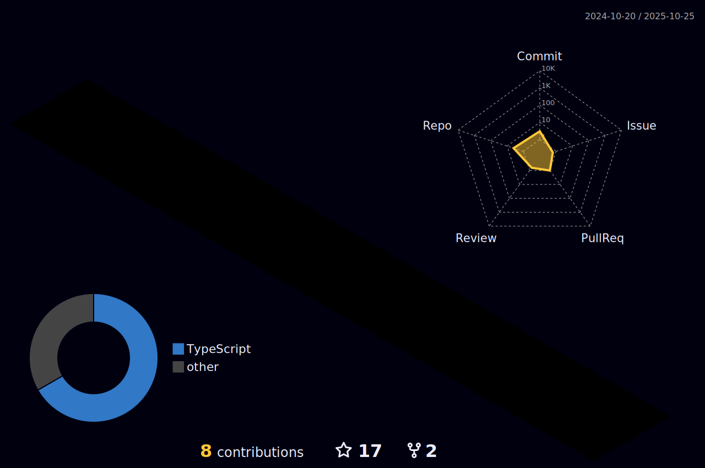

# Olá! meu nome é Rafael Rocha e esta é minha conta pessoal!

- 🖥️ Desenvolvedor Full Stack na [uMode](https://www.umode.com.br)
- 🖥️ Veja minha conta de trabalho [aqui](https://github.com/URafaelRocha)
- 🌍 Moro em Campos dos Goytacazes - RJ
- 🖥️ Veja o meu [Portfolio](https://rafaelrocha.vercel.app)
- ✉️ Você pode entrar em contato comigo a partir do [email](mailto:1rafaelrocha2@gmail.com)

 

## Minhas Stacks

  <h3>Front End:</h3>

  
  
  
  
  
  
  
  
  
  
  

   

  <h3>Back End:</h3>

  
  
  
  
  
  
  
  
  

   

  <h3>Banco de Dados:</h3>

  
  
  
  
  

   

  <h3>Testes:</h3>

  
  
  

 

## Status do GitHub

 

 

	

